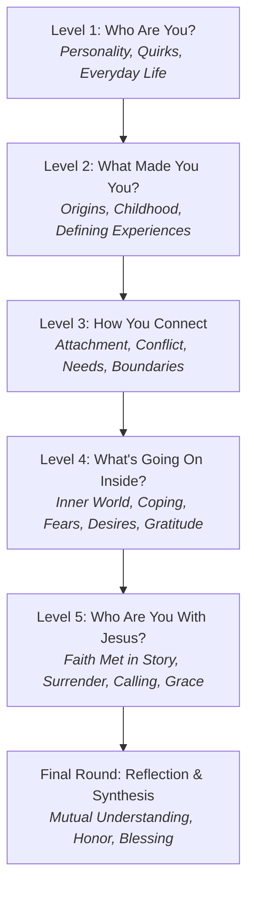

# Holy Ground: Complete Question Framework & Progression Guide

> **Core Purpose**: *"By the end of the game, I should understand who you are, what shaped you, what matters to you, how you relate to people, what you fear, what you hope for, and how your faith fits into all of that."*

---

## 1. Architectural Overview & The 5-Stage Arc

Rather than simply increasing "vulnerability" or "pain," the game is structured around **layers of knowing a person**.



| Level | Name | Core Question | Accent | Purpose & Player Takeaway |
|---|---|---|---|---|
| **Level 1** | **Who Are You?** | *"What are you like in everyday life?"* | `#E11D48` (Coral Rose) | *"I know what you like, how you think, and what you're like in everyday life."* (Quirks, humor, passions, social styles). |
| **Level 2** | **What Made You You?** | *"What experiences shaped you?"* | `#D97706` (Amber Gold) | *"I understand the childhood, family, and pivotal moments that shaped the person in front of me."* |
| **Level 3** | **How You Connect** | *"How do you connect and relate?"* | `#0284C7` (Ocean Teal) | *"I understand how you attach, communicate, withdraw, handle conflict, and how to love you better."* |
| **Level 4** | **What's Going On Inside?** | *"Who is the person beneath the mask?"* | `#8B5CF6` (Royal Indigo) | *"I understand your internal world, fears, coping mechanisms, contrasts, and quiet hopes."* |
| **Level 5** | **Who Are You With Jesus?** | *"How does Jesus meet you in your story?"* | `#C59B27` (Sacred Bronze) | *"I understand how God is transforming you, your theology in practice, and where grace meets your reality."* |
| **Final** | **The Reflection Round** | *"What do we now understand about each other?"* | `#059669` (Emerald Jade) | Synthesis, mutual affirmation, prayer needs, and closing blessings. |

---

## 2. Psychological Design Principles

1. **Stop Making Every Question an Interrogation ("Trauma ≠ Depth")**:
   - Depth does not require forcing people to disclose raw wounds right away. 
   - Deep joy, gratitude, unspoken dreams, and values are just as intimate as grief or insecurity.
2. **The Psychological Ladder**:
   $$\text{Fact} \longrightarrow \text{Preference} \longrightarrow \text{Reason} \longrightarrow \text{Story} \longrightarrow \text{Meaning} \longrightarrow \text{Pattern} \longrightarrow \text{Belief} \longrightarrow \text{Response}$$
3. **Card Archetypes**:
   - `standard`: A sharp reflective question paired with an optional **"Want to go deeper? Tap →"** narrative prompt.
   - `story` (*"Tell Me the Story"*): Prompts an experiential narrative rather than an intellectual statement.
   - `diagnostic` (*"How Do You Operate?"*): Offers multi-choice behavioral chips that normalize self-awareness.
   - `contrast` (*"Internal Tension"*): Highlights paradoxes in personality without guilt.
   - `values` (*"Values & Identity"*): Explores what a person respects, protects, and honors.
   - `reflection`: Synthesizes group discovery and builds lasting community ties.

---

## 3. Data Schema Specification

Every card in `src/data/questions.js` follows this enriched schema:

```javascript
{
  id: 'q2-origins-1',
  levelId: 'level-2',             // 'level-1' | 'level-2' | 'level-3' | 'level-4' | 'level-5' | 'final-round'
  archetype: 'story',             // 'standard' | 'story' | 'diagnostic' | 'contrast' | 'values' | 'reflection'
  category: 'Origins & Childhood',
  text: 'What were you like as an eight-year-old that you are still like today?',
  deeper: 'Can you recall a specific childhood moment when that trait was on full display?', // Nullable
  options: null,                  // Array of strings for diagnostic cards, or null
  subtext: 'Look for the continuous thread connecting your past self to who you are today.'
}
```

---

## 4. Complete Question Bank

### LEVEL 1 — WHO ARE YOU?
*Surface → preferences → personality → everyday life*

1. **`[standard]` • Passion**  
   **Question:** What’s something you could spend three hours doing and not realize three hours passed?  
   ↳ **Go deeper:** *When did this first become a love of yours?*
2. **`[standard]` • Social Personality**  
   **Question:** When you’re completely comfortable around people, what version of you comes out?  
   ↳ **Go deeper:** *What is an environment where that version of you feels easiest to access?*
3. **`[standard]` • Quirks & Competition**  
   **Question:** What’s something you get weirdly competitive about, even when it doesn't matter?  
   ↳ **Go deeper:** *Where did that competitive streak come from?*
4. **`[standard]` • Emotional Preferences**  
   **Question:** What’s a very small, specific thing that can instantly make a bad day better?  
   ↳ **Go deeper:** *When was the last time that small thing saved your day?*
5. **`[standard]` • Hidden Interests**  
   **Question:** What’s something you genuinely love that you almost never get to talk about?  
   ↳ **Go deeper:** *Why does it stay in the background?*
6. **`[standard]` • Private Side**  
   **Question:** What’s something your closest friends know about you that a new person would never guess?  
   ↳ **Go deeper:** *Why do you think that part of you stays behind the curtain at first?*
7. **`[standard]` • Private Behavior**  
   **Question:** What is something you do completely differently when nobody else is in the room?  
   ↳ **Go deeper:** *What does that reveal about your true unmasked self?*
8. **`[standard]` • Belonging**  
   **Question:** What’s a very specific sensory detail, routine, or feeling that makes you feel at home somewhere?  
   ↳ **Go deeper:** *Where is a place outside of your house where you felt that instantly?*
9. **`[standard]` • Desires & Social Needs**  
   **Question:** What’s something you quietly wish people would invite you to do more often?  
   ↳ **Go deeper:** *What holds you back from initiating it yourself?*
10. **`[standard]` • Relational Identity**  
    **Question:** What kind of person do you naturally become around your oldest, closest friends?  
    ↳ **Go deeper:** *Who in your life brings out the truest version of you?*
11. **`[diagnostic]` • Social Dynamics**  
    **Question:** In a group gathering, which mode do you naturally default into?  
    **Options:** `[ The Observant Listener ]` `[ The Conversation Spark ]` `[ The Quiet Anchor ]` `[ The Host Making Sure Everyone is OK ]`
12. **`[standard]` • Harmless Strong Opinions**  
    **Question:** What is something you have surprisingly passionate opinions about that ultimately doesn't matter at all?  
    ↳ **Go deeper:** *What hill are you irrationally prepared to die on?*
13. **`[standard]` • Daily Rhythm**  
    **Question:** What part of your daily routine do you fiercely protect from interruption?  
    ↳ **Go deeper:** *What happens to your mood if that rhythm gets thrown off?*
14. **`[diagnostic]` • Energy Drain**  
    **Question:** What drains your social battery faster than anything else?  
    **Options:** `[ Surface Small Talk ]` `[ Chaos & Loud Noise ]` `[ Constant Decision Making ]` `[ Unresolved Conflict in the Room ]` `[ Feeling Pressure to Perform ]`
15. **`[standard]` • First Impressions**  
    **Question:** What is something people often misinterpret about you before they actually get to know you?  
    ↳ **Go deeper:** *Can you recall a time someone admitted their initial impression was totally wrong?*
16. **`[standard]` • Humor & Laughter**  
    **Question:** What kind of humor makes you laugh so hard your stomach hurts?  
    ↳ **Go deeper:** *Who is the person who can make you laugh faster than anyone else?*
17. **`[standard]` • Spontaneity vs Order**  
    **Question:** How do you react when a whole weekend’s plans get cancelled at the last minute?  
    ↳ **Go deeper:** *Is it secret relief or restless frustration?*
18. **`[standard]` • Natural Gravitation**  
    **Question:** If you were left completely alone in a giant bookstore or record shop for two hours, which section would we find you in?  
    ↳ **Go deeper:** *What draws you toward that world?*
19. **`[diagnostic]` • Group Decisions**  
    **Question:** When a group cannot decide where to eat or what to do next, what is your instinct?  
    **Options:** `[ Step in and make the call ]` `[ Go with whatever others want ]` `[ Secretly feel impatient ]` `[ Quietly slip away ]`
20. **`[story]` • Signature Story**  
    **Question:** Tell us about a funny, quirky, or absurd moment in your life that perfectly summarizes your personality.

---

### LEVEL 2 — WHAT MADE YOU YOU?
*Stories → family → childhood → experiences → relationships*

1. **`[standard]` • Childhood Continuity**  
   **Question:** What were you like as an eight-year-old that you are still like today?  
   ↳ **Go deeper:** *Can you recall a specific childhood moment when that trait was on full display?*
2. **`[standard]` • Childhood Desires**  
   **Question:** What did you love doing as a child that you eventually stopped doing as you grew up?  
   ↳ **Go deeper:** *Why did you let it go, and do you ever miss it?*
3. **`[standard]` • Family Role**  
   **Question:** What was something you were known for in your family or household growing up?  
   ↳ **Go deeper:** *Did that role feel like a gift or an expectation?*
4. **`[standard]` • Childhood Needs**  
   **Question:** What did you need a lot of as a child that you didn't always get or know how to ask for?  
   ↳ **Go deeper:** *How does that unmet need still echo in your life today?*
5. **`[story]` • Defining Memory**  
   **Question:** Tell us about one childhood or teenage memory that explains a lot about who you are today.
6. **`[standard]` • Generational Lessons: Success**  
   **Question:** What did your family or upbringing teach you about what it means to be "successful"?  
   ↳ **Go deeper:** *How much of that definition do you still agree with today?*
7. **`[standard]` • Generational Lessons: Failure**  
   **Question:** What did your family teach you about failure—was it met with anger, silence, humor, or problem-solving?  
   ↳ **Go deeper:** *Can you remember a specific mistake you made and how the adults around you reacted?*
8. **`[standard]` • Generational Lessons: Love**  
   **Question:** How was love expressed in your home growing up: words, affection, acts of service, providing, or high expectations?  
   ↳ **Go deeper:** *What felt easiest to feel, and what felt rare?*
9. **`[standard]` • Generational Lessons: Conflict**  
   **Question:** What did you learn about conflict from watching the adults around you?  
   ↳ **Go deeper:** *Did you learn to yell, appease, withdraw, or resolve?*
10. **`[contrast]` • Generational Legacy**  
    **Question:** What is one value or habit from your upbringing you are determined to carry forward, and what is one you want to leave behind?
11. **`[standard]` • Relational Guardrails**  
    **Question:** What happened in your life that taught you to become careful about trusting people?  
    ↳ **Go deeper:** *What was the turning point where you realized not everyone is safe?*
12. **`[story]` • Growing Up**  
    **Question:** Tell us about a specific moment when you suddenly realized, "I am not a kid anymore."
13. **`[story]` • The Unseen Believer**  
    **Question:** Tell us about a time someone believed in you before you believed in yourself.
14. **`[story]` • The Out-of-Place Moment**  
    **Question:** Tell us about a time you felt completely out of place, and how you handled being on the outside.
15. **`[story]` • The Friendship Turning Point**  
    **Question:** Tell us about a friendship that changed the trajectory of your life.
16. **`[standard]` • School Years**  
    **Question:** What kind of kid were you in school—the rule follower, the invisible one, the perfectionist, the class clown, or the rebel?  
    ↳ **Go deeper:** *What were you trying to protect or prove back then?*
17. **`[story]` • A Fork in the Road**  
    **Question:** Tell us about a decision that felt small at the time, but completely changed the direction of your life.
18. **`[standard]` • Outside Influences**  
    **Question:** Besides your parents, who was an adult who had a profound, lasting impact on the person you became?  
    ↳ **Go deeper:** *What did they say or model that stayed with you?*
19. **`[standard]` • Perspective Shift**  
    **Question:** What is something you were confident you were right about when you were younger that you now see completely differently?  
    ↳ **Go deeper:** *What experience humbled or expanded your view?*
20. **`[standard]` • Overcoming**  
    **Question:** What was a season in your earlier life that felt overwhelming while you were in it, but gave you strength you still rely on today?  
    ↳ **Go deeper:** *What did you learn about your own resilience?*

---

### LEVEL 3 — HOW YOU CONNECT
*Relationships → attachment → conflict → needs → communication*

1. **`[standard]` • Feeling Cared For**  
   **Question:** What makes you feel deeply cared for by a friend?  
   ↳ **Go deeper:** *Can you share a specific moment when someone did that for you?*
2. **`[standard]` • Safety**  
   **Question:** What makes you feel safe enough to be completely honest with someone without filtering yourself?  
   ↳ **Go deeper:** *What is an immediate sign that tells you a room or person is not safe?*
3. **`[standard]` • Withdrawal Instincts**  
   **Question:** What makes you instinctively pull back or go cold toward someone you care about?  
   ↳ **Go deeper:** *What does your withdrawal look like—silence, busyness, humor, or physical distance?*
4. **`[diagnostic]` • Conflict Style**  
   **Question:** When someone hurts your feelings or frustrates you, what is your immediate first reflex?  
   **Options:** `[ Explain myself / Confront immediately ]` `[ Withdraw into quiet distance ]` `[ Rush to fix it & smooth things over ]` `[ Pretend I'm fine / Brush it off ]` `[ Vent to a third party ]`
5. **`[diagnostic]` • Vulnerability Gate**  
   **Question:** Which sentence is genuinely hardest for you to say out loud to someone close to you?  
   **Options:** `[ "I need help." ]` `[ "I was wrong / I'm sorry." ]` `[ "I don't know." ]` `[ "You hurt my feelings." ]`
6. **`[standard]` • Unspoken Needs**  
   **Question:** What is something you genuinely need from people close to you, but almost never ask for?  
   ↳ **Go deeper:** *What makes it so difficult to ask for directly?*
7. **`[contrast]` • Giving vs Receiving**  
   **Question:** What is something you are very generous at giving to other people, but feel terribly awkward receiving yourself?
8. **`[standard]` • Being Misunderstood**  
   **Question:** Who in your life do you feel most misunderstood by, and what has made it hard to clear the air?  
   ↳ **Go deeper:** *What is the assumption they make about you that hurts the most?*
9. **`[standard]` • Boundaries**  
   **Question:** What is a healthy boundary you’ve had to learn the hard way in relationships?  
   ↳ **Go deeper:** *What did it cost you before you learned to set it?*
10. **`[standard]` • Space vs Closeness**  
    **Question:** When you are going through a difficult time, do you want people to check in constantly, or do you need space first?  
    ↳ **Go deeper:** *What is the ideal way a friend can step into your world when you're overwhelmed?*
11. **`[standard]` • Loneliness in Community**  
    **Question:** Have you ever felt completely lonely even while surrounded by friends or at church? What was going on underneath?  
    ↳ **Go deeper:** *What would have helped bridge the gap?*
12. **`[standard]` • Trust Signals**  
    **Question:** What is one small green flag that makes you trust a person quickly, and one red flag that makes you shut down?  
    ↳ **Go deeper:** *Where did you learn to watch for that red flag?*
13. **`[story]` • Grace Encounter**  
    **Question:** Tell us about a time someone gave you unexpected grace when you fully expected frustration, anger, or judgment.
14. **`[standard]` • Showing Love**  
    **Question:** How do you naturally show love to others when you really care about them?  
    ↳ **Go deeper:** *Do the people in your life usually recognize it as love, or does it get missed?*
15. **`[story]` • Seen Without Speaking**  
    **Question:** Tell us about a time someone noticed you were struggling before you said a single word. What did that feel like?
16. **`[standard]` • Repair & Apology**  
    **Question:** What does a meaningful apology sound like to you—and what kind of apology feels completely empty?  
    ↳ **Go deeper:** *Can you recall an apology that genuinely healed a relationship for you?*
17. **`[standard]` • Rejection Sensitivity**  
    **Question:** When a friend takes days to respond or plans fall through, what narrative does your mind instinctively jump to?  
    ↳ **Go deeper:** *How do you bring yourself back to what is actually true?*
18. **`[standard]` • Ideal Friendship**  
    **Question:** If you could describe the exact kind of friendship your heart is longing for in this season, what does it look like?  
    ↳ **Go deeper:** *What step can you take to invite that in?*
19. **`[contrast]` • Patience**  
    **Question:** Where are you noticeably more patient and forgiving with other people than you are with yourself?
20. **`[standard]` • Encouragement That Landed**  
    **Question:** What is a compliment or word of encouragement someone gave you years ago that you still remember word for word?  
    ↳ **Go deeper:** *Why did that particular sentence stick to your bones?*

---

### LEVEL 4 — WHAT’S GOING ON INSIDE?
*Identity → fears → desires → coping → wounds → internal world*

1. **`[standard]` • The Shield**  
   **Question:** What is something you pretend doesn’t affect you—but secretly gets to you every time?  
   ↳ **Go deeper:** *Why do you feel the need to act unbothered by it?*
2. **`[standard]` • Survival Mechanisms**  
   **Question:** What part of your personality was shaped more by survival or self-protection than truth?  
   ↳ **Go deeper:** *When did that protective wall start going up?*
3. **`[standard]` • Midnight Thoughts**  
   **Question:** What does your mind tend to replay when you are alone in bed at night and everything is quiet?  
   ↳ **Go deeper:** *Is it conversations, worries about the future, or old regrets?*
4. **`[diagnostic]` • Under Stress**  
   **Question:** When life feels completely overwhelming and stress peaks, what do you become more of?  
   **Options:** `[ Hyper-Quiet & Withdrawn ]` `[ Controlling & Micromanaging ]` `[ Sarcastic / Overly Funny ]` `[ Frantic & Ultra-Busy ]` `[ Irritated & Short-Tempered ]`
5. **`[diagnostic]` • Failure Reflex**  
   **Question:** When you fail at something you cared deeply about, what is the very first sentence your mind says to you?  
   **Options:** `[ "You should have known better." ]` `[ "You're not cut out for this." ]` `[ "How do I fix this right now?" ]` `[ "It wasn't my fault anyway." ]`
6. **`[diagnostic]` • Uncertainty Reflex**  
   **Question:** When life feels completely unpredictable, what is the thing you instinctively try to control?  
   **Options:** `[ My schedule & routine ]` `[ Other people's perceptions ]` `[ Food / Exercise / Body ]` `[ Money & Spending ]` `[ Nothing (I freeze / check out) ]`
7. **`[contrast]` • Public vs Private Self**  
   **Question:** What do you want other people to think about you, and what do you actually think about yourself in private?
8. **`[contrast]` • Stated Values vs Reality**  
   **Question:** What is something you sincerely say you value, but your schedule and habits prove you struggle to make room for?
9. **`[contrast]` • Confidence vs Fragility**  
   **Question:** What is an area of life where you feel rock-solid confident, and what is an area where you feel surprisingly fragile?
10. **`[values]` • What You Won't Become**  
    **Question:** What is something you would never want to become, even if becoming it guaranteed you wealth and success?  
    ↳ **Go deeper:** *Where did that conviction come from?*
11. **`[values]` • Earning Respect**  
    **Question:** What kind of person earns your respect almost immediately—and what makes you lose respect for someone just as fast?  
    ↳ **Go deeper:** *What core boundary does that touch?*
12. **`[values]` • Beneath the Resume**  
    **Question:** If someone described you accurately to a room of strangers but left out all your titles, work, and achievements, what would you want them to mention?
13. **`[standard]` • Comparison Trap**  
    **Question:** When you find yourself falling into comparison or envy, who or what is usually triggering it?  
    ↳ **Go deeper:** *What fear does that comparison tap into?*
14. **`[standard]` • Hidden Gratitude**  
    **Question:** What is something you are deeply grateful happened to you now, even though you hated every second of it when it occurred?  
    ↳ **Go deeper:** *How did that season reshape your character?*
15. **`[standard]` • Present Wonder**  
    **Question:** What is something about your life right now that you genuinely don't want to take for granted?  
    ↳ **Go deeper:** *Take a moment to speak that gratitude out loud.*
16. **`[values]` • Protecting What Matters**  
    **Question:** What is one conviction or relationship you would protect even if it cost you your reputation or convenience?
17. **`[standard]` • The Unspoken Wish**  
    **Question:** What is something you wish the people in your life understood about what you carry every day, without you having to explain it?  
    ↳ **Go deeper:** *What stops you from letting them carry it with you?*
18. **`[standard]` • Lingering Regret**  
    **Question:** What’s a past decision or conversation that you still think about more than you’d like to admit?  
    ↳ **Go deeper:** *What grace or closure has been hard to accept there?*
19. **`[standard]` • Looking Forward**  
    **Question:** What would make you look back at your life thirty years from now and think, "I am so glad I lived this way"?  
    ↳ **Go deeper:** *What choice today keeps you on that path?*
20. **`[story]` • The Mask Comes Off**  
    **Question:** Tell us about a time you tried so hard to keep it all together until you finally broke down and let someone see you were falling apart.

---

### LEVEL 5 — WHO ARE YOU WITH JESUS?
*Faith → identity → surrender → calling → transformation*

1. **`[standard]` • Character of God**  
   **Question:** What part of God’s character is easiest for you to believe, and which part is hardest to believe when life gets difficult?  
   ↳ **Go deeper:** *Compassion, sovereignty, justice, presence, or provision?*
2. **`[standard]` • Trust & Release**  
   **Question:** What is hardest for you to trust God with, and why do you think that particular thing is so difficult to release?  
   ↳ **Go deeper:** *What outcome are you terrified will happen if you let go?*
3. **`[standard]` • The Divine Gaze**  
   **Question:** When you picture God looking directly at you right now, what do you honestly imagine He sees and feels?  
   ↳ **Go deeper:** *Is it disappointment, patience, affection, or expectation?*
4. **`[contrast]` • Forgiveness vs Enjoyment**  
   **Question:** Which is easier for your heart to believe: that God forgives you, or that God actually enjoys being with you?
5. **`[standard]` • Spiritual Silence**  
   **Question:** What do you tend to do when God feels silent or distant in your life?  
   ↳ **Go deeper:** *Do you press in, get cynical, work harder, or drift into numbness?*
6. **`[standard]` • Intellectual vs Heart Faith**  
   **Question:** What is something about God you understand completely in your head, but still struggle to live like it’s true?  
   ↳ **Go deeper:** *What would your daily life look like if your heart caught up with your mind?*
7. **`[standard]` • Faith Evolution**  
   **Question:** What did you believe about God when you were younger that has matured or changed as you’ve experienced real life?  
   ↳ **Go deeper:** *What shattered the earlier, simpler view?*
8. **`[story]` • The Unexpected Kindness**  
   **Question:** Tell us about a time you experienced God's kindness in a way you completely didn't expect or deserve.
9. **`[standard]` • Gospel in the Flesh**  
   **Question:** What part of following Jesus has most visibly changed the way you treat other people?  
   ↳ **Go deeper:** *Who is someone you love differently today because of Jesus?*
10. **`[standard]` • The Resisted Lesson**  
    **Question:** What is something you keep asking God to change or take away, and what do you think He might be teaching you through it instead?  
    ↳ **Go deeper:** *Why is that lesson so hard to embrace?*
11. **`[standard]` • Performance vs Grace**  
    **Question:** Where in your life or faith do you still quietly feel like you have to earn God’s approval?  
    ↳ **Go deeper:** *What happens to your peace when you slip up?*
12. **`[story]` • The Surprising God**  
    **Question:** Tell us about a time God surprised you—either by an unexpected answer, a shut door, or a sudden peace.
13. **`[values]` • The Overlooked Christ**  
    **Question:** What do you think Jesus cares deeply about in a person that the modern church or culture often overlooks?  
    ↳ **Go deeper:** *How does that challenge your own priorities?*
14. **`[standard]` • Calling & Reluctance**  
    **Question:** What is something you sense God nudging you toward, but you feel unqualified or hesitant to step into?  
    ↳ **Go deeper:** *What is the fear saying to you?*
15. **`[story]` • Prayer in the Dark**  
    **Question:** Tell us about a time a season of prayer changed your heart, even when your external circumstances didn’t change at all.
16. **`[standard]` • What He Is Forming**  
    **Question:** Knowing your quirks, wounds, and hopes, what kind of person do you sense Jesus is patiently forming you into?  
    ↳ **Go deeper:** *What old layer of yourself is having to die in the process?*
17. **`[standard]` • Doubts & Anchors**  
    **Question:** What kind of situation makes you wrestle most with your faith, and what is the anchor that always pulls you back?  
    ↳ **Go deeper:** *What truth keeps you from walking away?*
18. **`[standard]` • Generous Grace**  
    **Question:** When has your understanding of the cross gone from an abstract doctrine to something that broke your heart wide open?  
    ↳ **Go deeper:** *What was happening in your life when that clicked?*
19. **`[standard]` • Spiritual Hunger**  
    **Question:** If Jesus sat across the table from you tonight and asked, "What do you want Me to do for you?", what would you say?  
    ↳ **Go deeper:** *Speak the raw, unedited answer.*
20. **`[standard]` • Holy Ground**  
    **Question:** Where in your life right now are you standing on holy ground—in a place that requires reverence, courage, and faith?  
    ↳ **Go deeper:** *Who are you inviting into that space with you?*

---

### THE FINAL ROUND — SYNTHESIS & REFLECTION
*Mutual understanding → honor → blessing*

1. **`[reflection]` • Being Understood**  
   **Question:** After everything you’ve shared tonight, what is something about who you are that you hope this group understands better now?
2. **`[reflection]` • The Unexpected Gift**  
   **Question:** What is something you learned about someone sitting here tonight that you didn't expect, and why did it move you?
3. **`[reflection]` • How to Be Loved**  
   **Question:** Knowing where you are in life right now, what is one practical way this community can genuinely love and support you in the coming weeks?
4. **`[reflection]` • What to Remember**  
   **Question:** If this group only remembered one thing you said tonight, what would you want it to be?
5. **`[reflection]` • The Ongoing Story**  
   **Question:** Knowing what you know about yourself now—your history, your struggles, and your hopes—what do you hope Jesus is still writing into your story?
6. **`[reflection]` • Relief & Truth**  
   **Question:** What was the most surprising moment of relief or freedom you felt during this game tonight?
7. **`[reflection]` • Seeing Christ in Others**  
   **Question:** Look at the person to your right: What is one reflection of Jesus’ character that you saw clearly in them as they shared tonight?
8. **`[reflection]` • A Blessing Spoken**  
   **Question:** Before we close, speak a one-sentence blessing, prayer, or declaration of hope over the person across from you.
